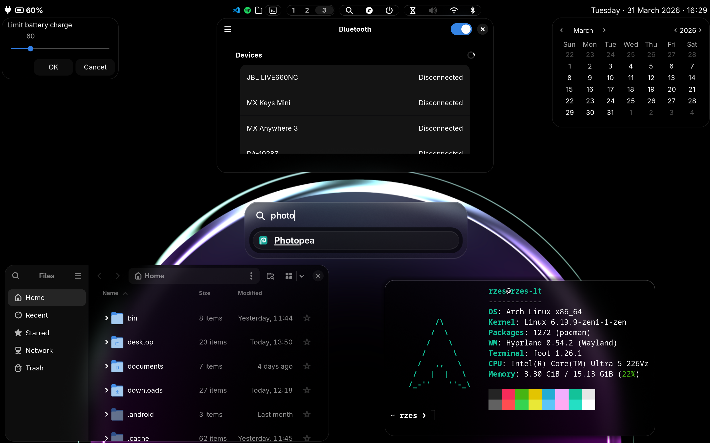

veri is a minimal but polished and visually pleasing setup on top of Arch Linux and Hyprland. It is aimed at experienced users who need freedom, but also value their time. The project's policy and architecture support tweaking every single aspect of an Arch Linux system, while providing a stable baseline for the configuration of a modern desktop. 



### Notable features

- Complete minimal desktop experience largely based on GTK apps
- Extensive system navigation that enables many tasks with only mouse or keyboard input for convenience
- Unified search (applications, shell, web search, and calculator), powered by Rofi
- Shell setup powered by Zsh
- Multiple touchpad gestures, including volume and screen brightness control while holding the Copilot key
- Screenshot tool with text recognition
- Instant web app setup based on Zen browser
- Control over charging for laptop batteries
- Clipboard history with images
- Emoji and unicode picker
- Numerous small utilities, like a zoom lens

# Installation guide

The installer is meant for a fresh Arch Linux installation. It is possible to install veri on top of a different environment, although things may and will break.

### Prerequisites

1. **Internet connection**

    An internet connection is required to download packages during the installation. It is recommended to use [iwd](https://wiki.archlinux.org/title/Iwd) for wireless connection. The installed environment will use iwd as backend.

2. **User account**

    A non-root user account must be set up to run the installer scripts:
    
    ```
    useradd -m <username>
    ```
    
    Don't forget to set a password:

    ```
    passwd <username>
    ```
    
3. **The installer itself**

    Once internet connection and a user account are set up, make sure to switch to the user: 
    
    ```
    su <username> && cd
    ```

    and then run:

    ```
    curl -L https://api.github.com/repos/rzesm/veri/tarball/main -o veri.tar.gz && tar -xzf veri.tar.gz
    ```
    
    This will put the installer in a folder in the current directory.

4. **Kernel parameters (recommended)**

    Add kernel parameters that will make the boot cleaner, particularly `quiet` and `splash`. How it's done depends on your bootloader. Here's an example with [systemd-boot](https://wiki.archlinux.org/title/Systemd-boot):
    
    ```
    options root=<UUID> rw loglevel=3 quiet splash systemd.show_status=false rd.udev.log_level=3 vt.global_cursor_default=0
    ```

### Using the installer

Run the `sync` script from the installer's directory, which will guide you through the installation/update. Finish an installation by rebooting your computer.

### Maintaining the system

It is completely fine to maintain the system as any other Arch Linux installation. However, I recommend you occasionally pull the latest installer and get available upgrades. As this is a young project, many features are yet to come.